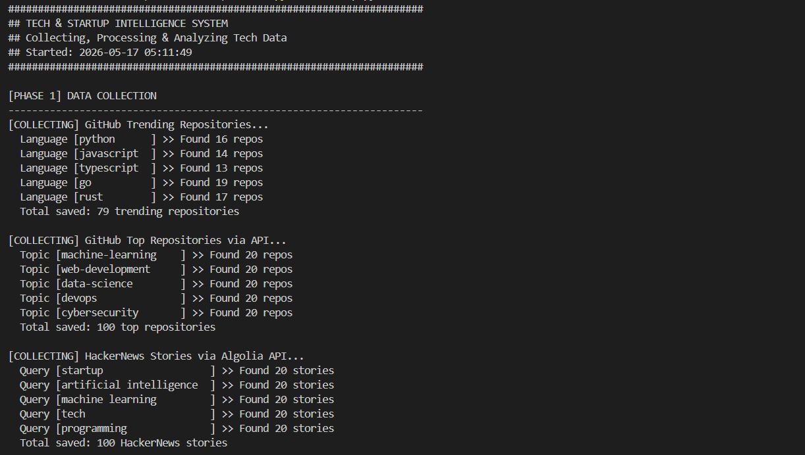
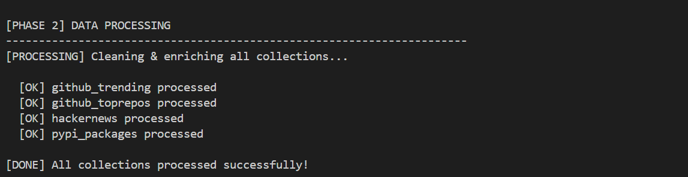
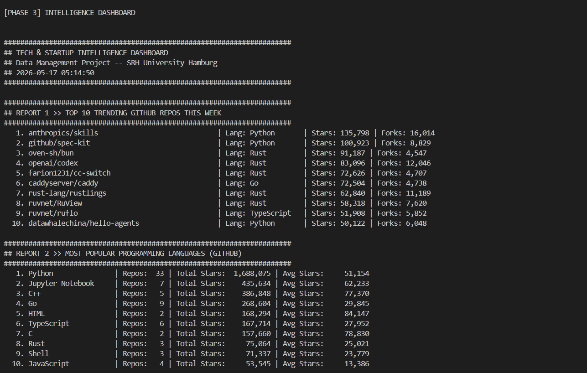
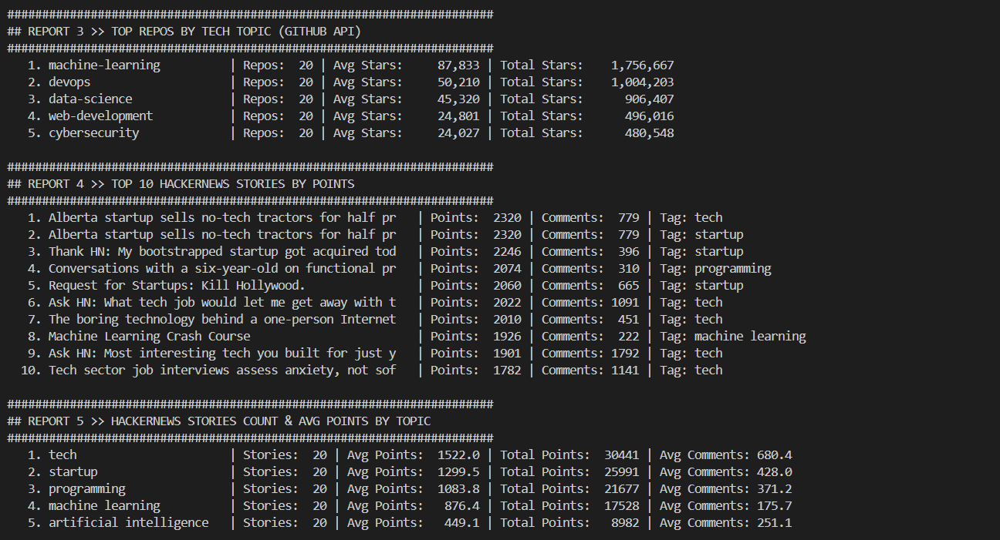

# Tech & Startup Intelligence System

> A Python-powered data collection and analysis pipeline that scrapes
> real-time tech ecosystem data from GitHub, HackerNews, and PyPI,
> storing everything in MongoDB Atlas for business intelligence.

---

## Data Sources

| # | Source | Type | Data Collected |
|---|--------|------|----------------|
| 1 | [GitHub Trending](https://github.com/trending) | Web Scraping | Trending repos, stars, forks, languages |
| 2 | [GitHub API](https://api.github.com) | REST API | Top repos by tech topic |
| 3 | [HackerNews Algolia](https://hn.algolia.com) | REST API | Tech startup stories, points, comments |
| 4 | [PyPI](https://pypi.org) | Web Scraping + API | Python packages, versions, authors |

---

## Business Intelligence Reports

| Report | Description |
|--------|-------------|
| Report 1 | Top 10 trending GitHub repositories this week |
| Report 2 | Most popular programming languages by stars |
| Report 3 | Top repositories ranked by tech topic |
| Report 4 | Top 10 HackerNews stories by points |
| Report 5 | HackerNews stories count & avg points by topic |
| Report 6 | Top Python packages by category |
| Report 7 | Complete database summary |

---

## Tech Stack

```
Python 3.13
├── requests        - HTTP requests & REST API calls
├── beautifulsoup4  - HTML parsing & web scraping
├── pymongo         - MongoDB Atlas connection
├── certifi         - SSL certificate verification
├── pandas          - Data processing
└── python-dotenv   - Environment configuration

MongoDB Atlas - Cloud Database (AWS Frankfurt)
```

---

## Project Structure

```
tech-startup-intel/
│
├── collectors/
│   ├── __init__.py
│   ├── github_trending.py    <- Scrapes GitHub trending repos
│   ├── github_toprepos.py    <- Fetches top repos via GitHub API
│   ├── hackernews.py         <- Fetches HN stories via Algolia API
│   └── pypi_packages.py      <- Scrapes PyPI package data
│
├── storage/
│   ├── __init__.py
│   └── db.py                 <- MongoDB connection handler
│
├── insights/
│   ├── __init__.py
│   ├── process.py            <- Data cleaning & enrichment
│   └── dashboard.py          <- Business intelligence reports
│
├── exports/
│   ├── 1.png                 <- Collection phase output
│   ├── 2.png                 <- Processing phase output
│   ├── 3.png                 <- Dashboard reports part 1
│   └── 4.png                 <- Dashboard reports part 2
│
├── .env                      <- MongoDB credentials (not in repo)
├── .gitignore
├── requirements.txt
├── prompts.txt               <- AI prompts used
├── startup.py                <- Main pipeline runner
└── README.md
```

---

## Setup & Installation

### 1. Clone the repository
```bash
git clone https://github.com/Yashank-Ganesh-A/tech-startup-intel.git
cd tech-startup-intel
```

### 2. Install dependencies
```bash
pip install -r requirements.txt
```

### 3. Configure MongoDB
Create `.env` file:
```
MONGODB_URI=your_mongodb_connection_string
DB_NAME=techstartup_db
```

### 4. Run full pipeline
```bash
python startup.py
```

### 5. Run only dashboard
```bash
python insights/dashboard.py
```

### 6. Test MongoDB connection
```bash
python storage/db.py
```

---

## MongoDB Collections

| Collection | Source | Records |
|------------|--------|---------|
| `github_trending` | github.com/trending | 79 |
| `github_toprepos` | api.github.com | 100 |
| `hackernews` | hn.algolia.com | 100 |
| `pypi_packages` | pypi.org | 20 |
| **Total** | 4 sources | **299** |

---

## Sample Results

```
REPORT 1 >> TOP TRENDING GITHUB REPOS
  1. anthropics/skills     | Python | Stars: 135,795
  2. github/spec-kit       | Python | Stars: 100,918
  3. oven-sh/bun           | Rust   | Stars:  91,177

REPORT 2 >> MOST POPULAR LANGUAGES
  1. Python    | 33 Repos | Total Stars: 1,688,070
  2. C++       |  5 Repos | Total Stars:   386,846

REPORT 4 >> TOP HACKERNEWS STORIES
  1. Alberta startup sells no-tech tractors | Points: 2,320
  2. Thank HN: My startup got acquired      | Points: 2,246
```

---

## Output Screenshots

### Data Collection Phase


### Data Processing Phase


### Intelligence Dashboard Part 1


### Intelligence Dashboard Part 2


---

## Author

**Yashank Ganesh Akula**
SRH University Hamburg — Data Management Project
Summer Semester 2026